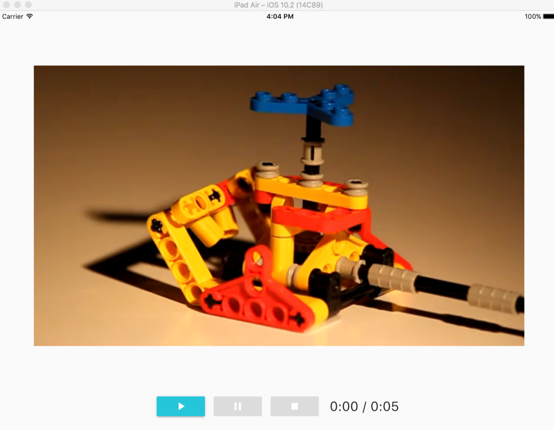

# Flutter iOS Videoplayer

An example of native ios video in a [flutter](http://flutter.io) app



## Flutter (Dart)

The Flutter app send messages to native "app container"

Flutter to iOS messages are send via [PlatformMessages.sendString](https://docs.flutter.io/flutter/services/PlatformMessages/sendString.html),
 which needs a messageName, and an optional parameter.
 
```dart
PlatformMessages.sendString('playVideo', kVideoUrl);
```

Each call receive a json response with a status = 1 || 0 and an optional string.

```json
{
  "status":1,
  "info":"an optional string"
}
```
The Flutter app also listen to Native message send from iOS 
via a [PlatformMessageChannel](https://docs.flutter.io/flutter/services/PlatformMessageChannel-class.html). 

```dart
static const PlatformMessageChannel<String> platform =
      const PlatformMessageChannel<String>("channelId", const StringCodec());

// ...

@override
void initState() {
  platform.setMessageHandler((String rawResponse) async {
    print('response : $rawResponse');
    return '';
  });
}

```

## iOS (Swift)

### [AppDelegate](https://github.com/rxlabz/flutter_videoplayer/blob/master/ios/Runner/AppDelegate.swift) & [FlutterMessageListener](https://github.com/rxlabz/flutter_videoplayer/blob/master/ios/Runner/player_listeners.swift)

On iOS side, each Flutter message is listen by a FlutterListener

```swift
class PlayerCommandListener: NSObject, FlutterMessageListener {
  var messageName: String = "flutterMessage"

  public func didReceive(_ message: String!) -> String! {
  print("got -> \(message)")
    return "NativeContainer received : \(message)"
  }
}

```

### [FlutterViewController](https://github.com/rxlabz/flutter_videoplayer/blob/master/ios/Runner/MediaPlayerViewController.swift)

The flutterViewController offers a method send() to send messages inside the flutter app

```swift
    send( "Pssst" , withMessageName: "channelId")
```

In this example, the MediaPlayerViewController class extends FlutterViewController, and implements the ability to draw a video "on top" of the flutter app. 

The viewController also send video progress infos to flutter.